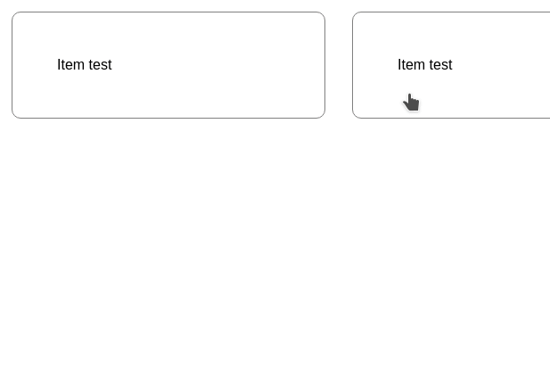

# sliderko

> 

[](https://www.npmjs.com/package/sliderko) [](https://standardjs.com)

A React horizontal slider with swipe gesture on both PC and mobile devices.
To use it, just wrap your content into the component. 



## Common instructions

## Install

```bash
npm install --save sliderko
```

## Usage

```jsx
import React, { Component } from 'react'
import Sliderko from 'sliderko'

class Example extends Component {
  render () {
    return (
      <Sliderko>
        <div style={{ display: "inline-block", width: 250, margin: 15, padding: 50, border: '1px solid gray', borderRadius: 10 }}>Item test</div>
        <div style={{ display: "inline-block", width: 250, margin: 15, padding: 50, border: '1px solid gray', borderRadius: 10 }}>Item test</div>
        <div style={{ display: "inline-block", width: 250, margin: 15, padding: 50, border: '1px solid gray', borderRadius: 10 }}>Item test</div>
        <div style={{ display: "inline-block", width: 250, margin: 15, padding: 50, border: '1px solid gray', borderRadius: 10 }}>Item test</div>
      </Sliderko>
    )
  }
}
```

## License

MIT © [rarokko](https://github.com/rarokko)
